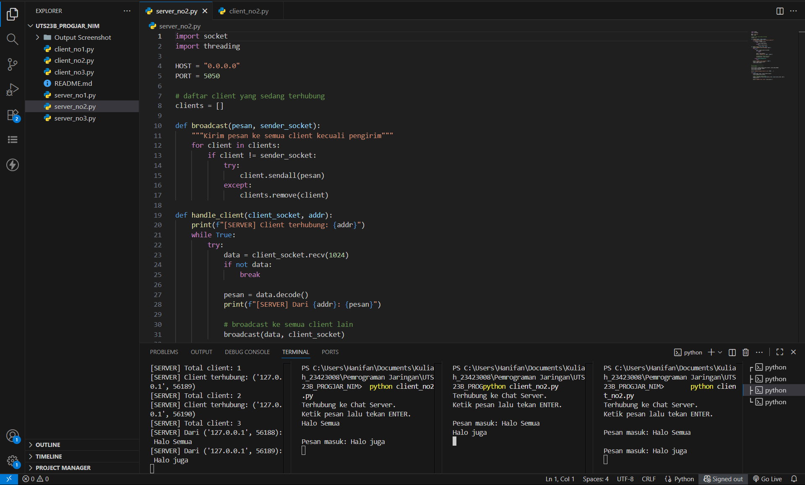
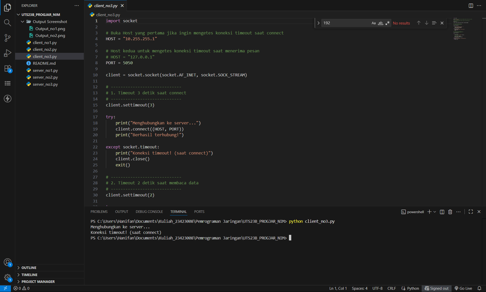
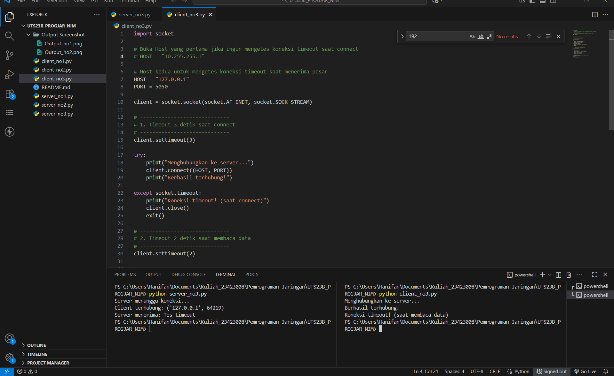

## Mata Kuliah: *Pemrograman Jaringan*
## Nama: *Hanifan Hidayatullah*
## NIM: *23423008*

---

## 🧩 **Daftar Isi**

1. [Pendahuluan](#pendahuluan)
2. [Soal 1 — TCP Echo Server](#soal-1--tcp-echo-server)
3. [Soal 2 — Multithreaded TCP Chat Server](#soal-2--multithreaded-tcp-chat-server)
4. [Soal 3 — TCP Client dengan Timeout](#soal-3--tcp-client-dengan-timeout)
5. [Langkah Pengujian](#langkah-pengujian)
6. [Kesimpulan](#kesimpulan)

---

## 📖 **Pendahuluan**

Dokumentasi ini berisi penjelasan dan langkah-langkah teknis dalam mengimplementasikan tiga tugas utama pada protokol **TCP (Transmission Control Protocol)**, yaitu:

1. **TCP Echo Server**
2. **Multithreaded TCP Chat Server**
3. **TCP Client dengan Timeout**

Fokus utama adalah bagaimana proses komunikasi terjadi antara server dan client, termasuk bagaimana server menangani banyak client sekaligus dan bagaimana client merespon kondisi timeout.

---

## 📝 **Soal 1 — TCP Echo Server**

### **Tujuan**

* Membangun server TCP sederhana yang menerima pesan dari client.
* Menampilkan pesan tersebut pada sisi server.
* Mengirim kembali (echo) pesan tersebut kepada client.
* Client harus mengirim pesan “Tes Koneksi” dan menampilkan balasan dari server.

### **Penjelasan Kerja**

1. Server membuka port **5050** dan menunggu koneksi (listen).
2. Client melakukan koneksi ke server.
3. Client mengirim pesan “Tes Koneksi”.
4. Server menerima pesan dan menampilkannya pada konsol server.
5. Server mengirim ulang pesan tersebut ke client.
6. Client menampilkan balasan (hasil echo).

---

## 📝 **Soal 2 — Multithreaded TCP Chat Server**

### **Tujuan**

* Membangun server TCP yang mampu menangani banyak client sekaligus.
* Minimal 3 client terhubung secara bersamaan.
* Setiap client dapat mengirim pesan ke server.
* Server melakukan **broadcast** ke semua client lain.

### **Penjelasan Kerja**

1. Server dijalankan pada port **5050** dan menunggu client masuk.
2. Setiap client yang terhubung ditangani oleh sebuah *thread* terpisah.
3. Ketika client mengirim pesan:

   * Server menerima pesan tersebut.
   * Server menyebarkan (broadcast) pesan ke semua client lain yang sedang aktif.
4. Jika ada client keluar (disconnect), server menghapusnya dari daftar client.

### **Alur Broadcast**

* Client A → Server → Dikirim ke Client B dan Client C
* Client B → Server → Dikirim ke Client A dan Client C
* Dan seterusnya.

---

## 📝 **Soal 3 — TCP Client dengan Timeout**

### **Tujuan**

* Implementasi client TCP yang memiliki:

  * Timeout **3 detik saat connect**
  * Timeout **2 detik saat membaca data**
  * Output error: **“Koneksi timeout!”** ketika waktu habis

### **Penjelasan Kerja**

1. Saat client mencoba menghubungkan ke server, diberikan batas waktu 3 detik.
   Jika tidak mendapat respons → dianggap timeout.
2. Setelah terhubung, client menunggu data dari server dengan batas waktu 2 detik.
   Jika tidak ada data masuk → timeout baca.
3. Saat timeout terjadi, client menampilkan pesan error yang sesuai.

### **Catatan Penting**

Pada Windows, timeout tidak akan terjadi apabila port ditolak (ConnectionRefused).
Oleh karena itu untuk menguji timeout connect, digunakan IP yang tidak dapat dijangkau, misalnya:
`10.255.255.1` (IP unreachable).

---

# 🧪 **Langkah Pengujian**

## **1. Pengujian Soal 1 (TCP Echo Server)**

### **A. Menjalankan Server**

* Jalankan program server TCP.
* Biarkan server dalam keadaan “listening”.

### **B. Menjalankan Client**

* Jalankan client di terminal terpisah.
* Client mengirim pesan “Tes Koneksi”.

### **C. Output yang Diharapkan**

#### Pada server:

```
Pesan diterima: Tes Koneksi
```

#### Pada client:

```
Balasan dari server: Tes Koneksi
```


---

## **2. Pengujian Soal 2 (Multithreaded Chat Server)**

### **A. Menjalankan Server**

* Jalankan program server chat.
* Server otomatis siap menerima banyak client.

### **B. Menjalankan 3 Client**

* Buka 3 terminal terpisah.
* Jalankan client ke-1, client ke-2, dan client ke-3.

### **C. Pengujian Broadcast**

* Kirim pesan dari client 1.
* Pesan harus muncul di **client 2 dan client 3**.
* Kirim pesan dari client 2.
* Pesan harus muncul di **client 1 dan client 3**.

### **D. Output yang Diharapkan**

#### Di client lain:

```
Pesan masuk: Hallo semua
```

#### Di server:

```
Dari 127.0.0.1: Hallo semua
```



---

## **3. Pengujian Soal 3 (TCP Timeout Client)**

### **A. Pengujian Timeout Saat Connect (3 detik)**

### Cara Agar Timeout Sukses:

Gunakan IP unreachable:

```
HOST = 10.255.255.1
```

### Output yang diharapkan:

```
Menghubungkan ke server...
Koneksi timeout! (saat connect)
```



---

### **B. Pengujian Timeout Saat Membaca Data (2 detik)**

### Cara Agar Timeout Berhasil:

1. Jalankan server yang *tidak mengirim data balasan*.
2. Jalankan client timeout.

### Output:

```
Koneksi timeout! (saat membaca data)
```



---

# 🏁 **Kesimpulan**

Dari seluruh rangkaian implementasi, diperoleh beberapa kesimpulan:

1. TCP memungkinkan pertukaran data yang stabil antara server dan client, baik untuk komunikasi sederhana maupun multi-user.
2. Konsep echo server memperkenalkan dasar komunikasi request–response.
3. Multithreaded server memungkinkan banyak client aktif dan mendukung broadcast.
4. Timeout sangat penting untuk mencegah client menggantung terlalu lama saat koneksi bermasalah.
5. Pemahaman mengenai kondisi *connection refused* dan *timeout* sangat diperlukan agar dapat menguji sistem secara benar.
